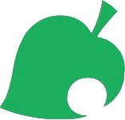

<div align="center">
  
  <h1>AI Chat Assistant</h1>
  <p>A powerful, intuitive AI chat application built with React and modern web technologies</p>
  
  <div>
    
    
    
    
  </div>
</div>

---

## ✨ Features

- **Intuitive Chat Interface**: Clean, responsive design for seamless conversations
- **Real-time Responses**: Instant AI-powered responses to your queries
- **Chat History**: Access and manage your previous conversations
- **Secure Authentication**: User authentication powered by Clerk
- **Dark Mode**: Easy on the eyes, perfect for late-night sessions
- **Responsive Design**: Works beautifully on desktop, tablet, and mobile devices

## 🖼️ Screenshots

<div align="center">
  
  <p><em>Main dashboard with chat history</em></p>
  
  
  <p><em>Chat interface with AI responses</em></p>
</div>

## 🚀 Getting Started

### Prerequisites

- Node.js (v16 or higher)
- npm or yarn
- An API key for the AI service

1. **Installation**:

   ```
   npm install destress-ai
   # or
   yarn add destress-ai
   ```

## Use Cases

- Share your daily highlights and challenges
- Process difficult emotions in a safe space
- Practice social interactions
- Document your life journey through ongoing conversations
- Receive gentle reminders for self-care

## Contribution

We welcome contributions to make DestressAI even better:

```
git clone https://github.com/yourusername/destress-ai.git
cd destress-ai
npm install
npm run dev
```

Please see [CONTRIBUTING.md](CONTRIBUTING.md) for detailed guidelines.

## License

DestressAI is licensed under the MIT License - see the [LICENSE](LICENSE) file for details.

## Support

Having issues or want to provide feedback? Reach out to us:

- Email: support@destressai.com
- Discord: [Join our community](https://discord.gg/destressai)
- GitHub Issues: [Report bugs](https://github.com/yourusername/destress-ai/issues)
